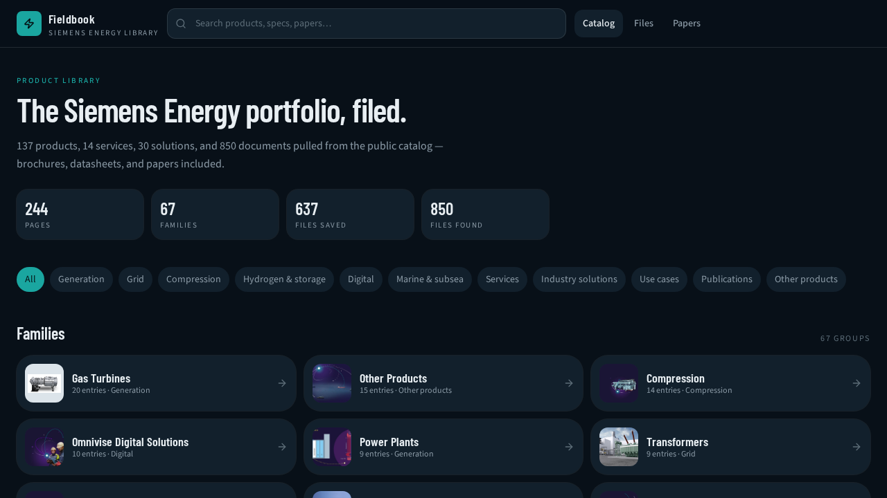

# Fieldbook — Siemens Energy Product Portfolio

A searchable static library of publicly published Siemens Energy product
material: 244 catalog pages, 67 families, and 850 brochures, datasheets, and
papers, with local copies of the smaller documents.

**Live site:** https://pedrodinisf.github.io/Siemens_Energy_Product_Portfolio/



## What it does

- **Search** everything — titles, descriptions, specs, FAQs, and file names.
- **Browse** by sector, family, or the global file index.
- **Product dossiers** with technical data tables, FAQs, related entries, and
  direct download links (local copies where available, source URLs otherwise).
- **Papers** view for white papers and technical papers.

## Data

Scraped on 2026-09-10 from the public
[product offerings catalog](https://www.siemens-energy.com/global/en/home/products-services/product-offerings.html).

| Bucket | Pages |
| --- | --- |
| Products | 137 |
| Services | 14 |
| Solutions | 30 |
| Publications | 61 |

- 850 files discovered; 637 archived. Small files are served from this repo,
  larger ones link to the Siemens Energy asset CDN.
- The scrape is preserved in [`data/siemens-energy/`](data/siemens-energy/) —
  one folder per page with a `README.md`, `product.json`, hero image, and
  `files/`. The app reads two generated files: `src/data/catalog-index.json`
  (metadata, bundled with the app) and `src/data/catalog-detail.json` (body and
  FAQ text, loaded on demand by item/family pages and full-text search). Run
  `npm run catalog:split` after re-scraping to regenerate them from
  `src/data/catalog.json`.
- Scraper: [`scripts/crawl-siemens-energy.py`](scripts/crawl-siemens-energy.py)
  plus [`scripts/catalog_images.py`](scripts/catalog_images.py). Kept for
  transparency; not required to run the app.

All content is © Siemens Energy AG, collected from public pages for research
and reference. This project is not affiliated with or endorsed by Siemens
Energy. Trademarks belong to their owners.

## Stack

- [TanStack Start](https://tanstack.com/start) + [TanStack Router](https://tanstack.com/router) (React 19, SSR)
- Vite 8, TypeScript (strict), Tailwind CSS v4
- Nitro (Vercel preset for the default deploy, static output for GitHub Pages)
- Node 22+, npm

## Repository layout

```
src/                  app code (routes, components, catalog store)
src/data/catalog.json full catalog (source of truth)
public/catalog/       locally served images and documents
data/siemens-energy/  full scrape archive (dossiers + files)
scripts/              scraper, build helpers, QA scripts
.github/workflows/    GitHub Pages deployment
screenshots/          UI reference shots
server/               platform PWA middleware (install page, head tags)
.grok/                app-builder workspace tooling
```

## Local development

Requires Node 22 or newer.

```sh
npm ci
npm run dev        # http://localhost:8080
```

Checks:

```sh
npm run typecheck
npm run lint
npm test
```

## Builds

```sh
npm run build          # default: Nitro Vercel output (SSR)
npm run build:pages    # static GitHub Pages build -> .pages/output/static
npm run preview        # serve the default build on 127.0.0.1:8081
```

The Pages build prerenders every route (244 items, 67 families, plus the
catalog, files, and papers views) into real HTML under
`/Siemens_Energy_Product_Portfolio/`, so deep links return 200 with readable
content and per-page titles. `scripts/pages-postbuild.mjs` then reconciles the
stylesheet links, adds Open Graph/Twitter share meta, writes a static PWA
manifest, and copies the home page to `404.html` so unknown URLs still boot the
client router.

Deployment happens automatically: pushing to `main` runs
[`.github/workflows/deploy-pages.yml`](.github/workflows/deploy-pages.yml)
(typecheck → build → deploy). The repository's Pages source is set to
**GitHub Actions**.

## Notes

- The default build targets Vercel via the Nitro preset; GitHub Pages is an
  additional static target selected only by `--mode pages`.
- The app is fully static. The original app-builder template's opt-in auth,
  database, connector, and multiplayer scaffolding has been removed along with
  its dependencies.
- On-host PWA/branding chrome served by the original platform runtime (install
  page, extension script) is not part of the static Pages build.
- Fonts (Barlow Condensed, Source Sans 3 — SIL Open Font License) are
  self-hosted from `src/assets/fonts/`, so the site makes no third-party font
  requests.
